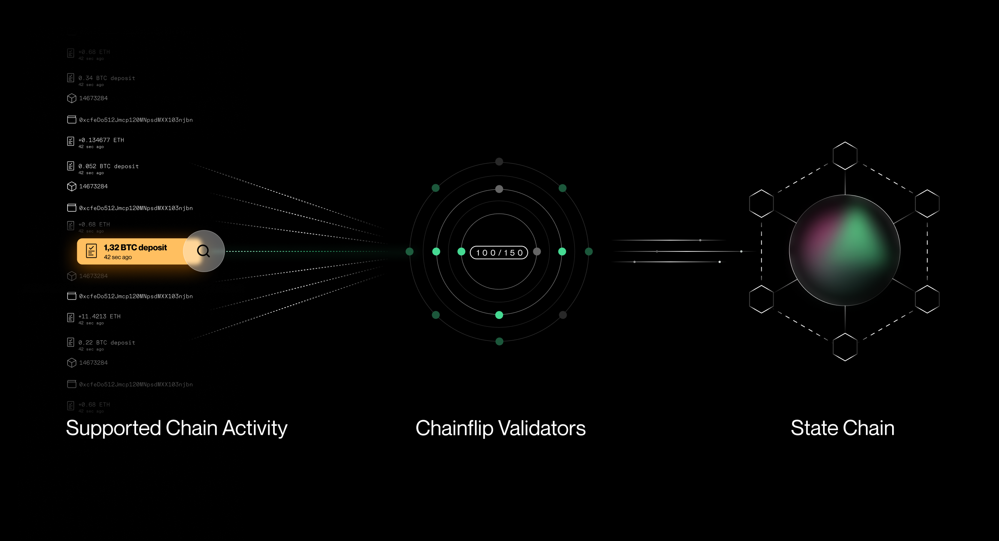

# Ingress: Witnessing Deposits

Ingress is the generic term to describe the process of observing external chains for events and registering those related to the Chainflip protocol. Some of those events include:

* Users sending deposits to be swapped
* Liquidity providers making deposits to add to their liquidity accounts
* Users funding their State Chain account for Validator auction bidding, broker operation, or any other reason);
* Changes to Vaults triggered by the network

## Witnessing&#x20;

All of these events are registered on the State Chain through **Witnessing**. Conceptually, we can say that the Witnessing process is functionally equivalent to a _Chainflip-specific Oracle service_.

The State Chain contains a list which instructs Validators what to look at on external chains. Certain contracts on Ethereum, particular wallet addresses on Bitcoin, and a myriad of other addresses and contracts on other chains can all be added to this “watchlist” for the Validators to scan external chains for.

#### Monitoring External Chains

As an essential function of the settlement system, Validators are required to maintain connections to light clients, full nodes, or other services which allow the Validator to query all Chainflip-supported blockchains. The way this is configured is up to each individual operator, but by losing connections to the external blockchains, the Validator will be sent offline until it has resolved the problem.

#### The Witness Process

Once a related transaction to an address or contract on the “watchlist” occurs on the external chain, the Validators wait until a pre-specified confirmation window has passed before Witnessing the event. The exact length of the confirmation window (measured in blocks) is assessed on a case-by-case basis for supported blockchains.

> No decentralised interoperability protocol can escape the reality of blockchain finality and are uniquely vulnerable to rollbacks on other chains, thus resulting in an inevitable delay before witnessing and processing can occur.

However, as soon as a block is detected on the supported blockchain which causes a deposit to be considered ‘final’ according to the Chainflip protocol’s definition, each Validator in the Authority Set submits a `witness` extrinsic to the State Chain. When over 2/3rds of the Authority Set (100 of 150 in the standard case) have done so, this finalises the witness event. From then on, the State Chain registers the event as ‘real,’ and the transaction details such as the TXID, asset, amount, and any relevant metadata are recorded on the State Chain.

If a Validator submitted a witness extrinsic which didn’t align with what other Validators have seen on the supported blockchain, the witness extrinsic would never reach sufficient consensus on the State Chain. This ‘false’ witness could then be used as proof to punish the Validator that submitted it. Similarly, nodes that frequently fail to witness events that the other 2/3rds of Validators catch within a given timeframe could also be grounds to programmatically punish a Validator through [**Slashing**](reputation-and-slashing.md)**.**

#### Summary

Witnessing is effectively how assets are passed through the settlement layer into the accounting layer, and is at the heart of all ingress processes, three of the main ones being:

* [state-chain-flip-gateway.md](state-chain-flip-gateway.md "mention")
* [native-swap-flow.md](../swaps-amm/native-swap-flow.md "mention")
* [liquidity-provider-accounts.md](../swaps-amm/liquidity-provider-accounts.md "mention")

###
