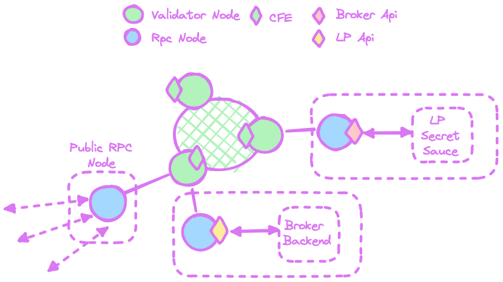

# Working Example

## Running a Broker API locally

To run the Broker API locally, head to this repo on Github and follow the instructions.



## Trying a working Broker API

If you want to try out the Broker functionality, we have deployed and exposed this endpoint:

* [https://chainflip-broker-api-partnernet.chainflip.io](https://chainflip-broker-api-partnernet.chainflip.io)


We strongly recommend operating your own APIs and never rely on 3rd parties. However, for testing purposes, feel free to use our Broker API.


## Deploying Schema

Brokers (and LPs) should ideally run their own local RPC nodes. These nodes connect to the network and expose the LP & Broker APIs locally to the backend they want to use.

<figure><figcaption>
Brokers and LPs running their own local RPC nodes.
</figcaption></figure>


Avoid using the public RPC node since its particularly vulnerable to DDOS or other various attacks

