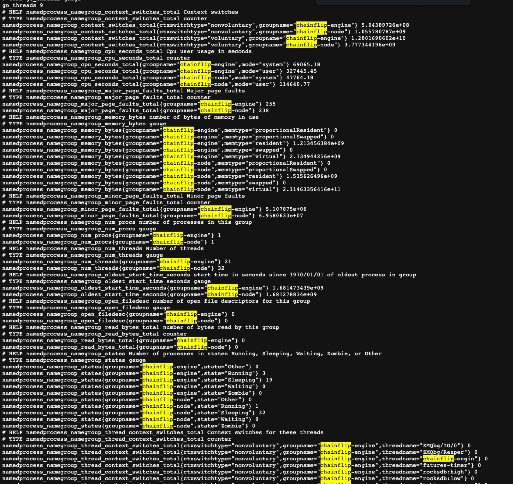

# Streaming Metrics to Chainflip

Node operators often fear the prospect of being **slashed**, which is a prevalent issue. The causes can vary widely, from network disruptions to a lack of available disk space to running on under-resourced machines.

To assist Chainflip in understanding why your node is experiencing slashing, streaming your node metrics would be highly advantageous. Chainflip asks that you install [process-exporter](https://github.com/ncabatoff/process-exporter) and [node-exporter](https://github.com/prometheus/node\_exporter) on your machines, so that we can scrape metrics using [Prometheus](https://prometheus.io/).

## Overview

The setup consists of the following components:

* Install Node Exporter and Process Exporter.
* Add configuration files.
* Update your `chainflip-node` `systemd` file to expose substrate prometheus metrics.
* Ensure that ports on your node are exposed to allow our Prometheus instance to access and scrape your metrics.

## Install Node Exporter

### Download Node Exporter Binary <a href="#download-node-exporter" id="download-node-exporter"></a>

```bash
cd /tmp
wget https://github.com/prometheus/node_exporter/releases/download/v1.5.0/node_exporter-1.5.0.linux-amd64.tar.gz
```

### Create `node_exporter` User <a href="#create-user" id="create-user"></a>

```bash
sudo groupadd -f node_exporter
sudo useradd -g node_exporter --no-create-home --shell /bin/false node_exporter
sudo mkdir -p /etc/node_exporter
sudo chown node_exporter:node_exporter /etc/node_exporter
```

### Unpack and Install Node Exporter Binary <a href="#unpack-node-exporter-binary" id="unpack-node-exporter-binary"></a>

```bash
tar -xvf node_exporter-1.5.0.linux-amd64.tar.gz
mv node_exporter-1.5.0.linux-amd64 node_exporter-files

sudo cp node_exporter-files/node_exporter /usr/local/bin/
sudo chown node_exporter:node_exporter /usr/local/bin/node_exporter

# Clean Up
rm -rf node_exporter-1.5.0.linux-amd64.tar.gz node_exporter-files
```

### Setup Node Exporter Service

Run the following command to create a service file:

```bash
sudo nano /etc/systemd/system/node_exporter.service
```

Then copy and paste the following into the service file:

```ini
[Unit]
Description=Node Exporter
Documentation=https://prometheus.io/docs/guides/node-exporter/
Wants=network-online.target
After=network-online.target

[Service]
User=node_exporter
Group=node_exporter
Type=simple
ExecStart=/usr/local/bin/node_exporter --web.listen-address=:9100

[Install]
WantedBy=multi-user.target
```

Save and exit (CTRL+x then hit `y` then hit `Enter`)

Change the file permissions:

```bash
sudo chmod 664 /etc/systemd/system/node_exporter.service
```

### Reload `systemd` and start the Node Exporter Service

```bash
sudo systemctl daemon-reload
sudo systemctl start node_exporter
sudo systemctl enable node_exporter
```


✋ Make sure your firewall exposes port `9100` publicly.


### Check the Whole Setup

#### Check the status of Node Exporter

```bash
sudo systemctl status node_exporter
```

You should see something like the following:

<figure><figcaption><p>Node Exporter Status</p></figcaption></figure>

#### Check whether Metrics are accessible

You can also verify that your node is exposing metrics by navigating to this url in a web browser:

```markdown
http://<your_node_public_ip_address>:9100/metrics
```

You should see the raw metrics that the node exporter exposes:

<figure><figcaption><p>Example of Node Exporter Metrics</p></figcaption></figure>


🤔 If you aren't able to access the metrics, double check your firewall settings and make sure port **`9100`** is exposed and publicly accessible.


## Install Process Exporter

Setting up Process Exporter is a similar process as in the previous section.


✋ The following commands are similar to the ones in the previous section but they are **not** the same. make sure to execute them in order.


### Download Process Exporter Binary <a href="#download-process-exporter" id="download-process-exporter"></a>

```bash
cd /tmp
wget https://github.com/ncabatoff/process-exporter/releases/download/v0.7.10/process-exporter-0.7.10.linux-amd64.tar.gz
```

### Create `process_exporter` User <a href="#create-user" id="create-user"></a>

```bash
sudo groupadd -f process_exporter
sudo useradd -g process_exporter --no-create-home --shell /bin/false process_exporter
sudo mkdir /etc/process_exporter
sudo chown process_exporter:process_exporter /etc/process_exporter
```

### Unpack and Install Process Exporter Binary <a href="#unpack-node-exporter-binary" id="unpack-node-exporter-binary"></a>

```bash
tar -xvf process-exporter-0.7.10.linux-amd64.tar.gz
mv process-exporter-0.7.10.linux-amd64 process_exporter-files

sudo cp process_exporter-files/process-exporter /usr/local/bin/process_exporter
sudo chown process_exporter:process_exporter /usr/local/bin/process_exporter

# Clean Up
rm -rf process-exporter-0.7.10.linux-amd64.tar.gz process_exporter-files
```

### Create Process Exporter Config File

```bash
sudo nano /etc/process_exporter/process-exporter.yaml
```

Then copy and paste the following into the file:

```yaml
process_names:
  - comm:
    - chainflip-node
    - chainflip-engine
```

### Setup Process Exporter Service

Run the following command to create a service file:

```bash
sudo nano /etc/systemd/system/process_exporter.service
```

Then copy and paste the following into the service file:

```ini
[Unit]
Description=Process Exporter for Prometheus
Documentation=https://github.com/ncabatoff/process-exporter
Wants=network-online.target
After=network-online.target

[Service]
User=process_exporter
Group=process_exporter
Type=simple
Restart=on-failure
ExecStart=/usr/local/bin/process_exporter \
  --config.path /etc/process_exporter/process-exporter.yaml \
  --web.listen-address=:9256

[Install]
WantedBy=multi-user.target
```

Save and exit (CTRL+x then hit `y` then hit `Enter`)

Change the file permissions:

```bash
sudo chmod 664 /etc/systemd/system/process_exporter.service
```

### Reload `systemd` and start the Node Exporter Service

```bash
sudo systemctl daemon-reload
sudo systemctl start process_exporter
sudo systemctl enable process_exporter.service
```


✋ Make sure your firewall exposes port **`9256`** publically.


### Check the Whole Setup

#### Check the status of Process Exporter

```bash
sudo systemctl status process_exporter
```

You should see something like the following:

<figure><figcaption><p>Process Exporter Status</p></figcaption></figure>

#### Check whether Metrics are accessible

You can also verify that your node is exposing metrics by navigating to in a web browser:

```markdown
http://<your_node_public_ip_address>:9256/metrics
```

You should see the raw metrics that the process exporter exposes:

<figure><figcaption><p>Example of Process Exporter Metrics</p></figcaption></figure>


🤔 If you aren't able to access the metrics, double check your firewall settings and make sure port **`9256`** is exposed and publically accessible.


## Expose Prometheus metrics for `chainflip-node`

`chainflip-node` is built using [substrate](https://github.com/paritytech/substrate) which uses Prometheus natively to expose metrics.&#x20;

To make those metrics available you will have to override the default `systemd` file that ships with the package. To do so run the following:

```bash
sudo mkdir -p /etc/systemd/system/chainflip-node.service.d/
cat <<EOF | sudo tee /etc/systemd/system/chainflip-node.service.d/override.conf >/dev/null
[Service]
ExecStart=
ExecStart=/usr/bin/chainflip-node \
  --chain /etc/chainflip/perseverance.chainspec.json \
  --base-path /etc/chainflip/chaindata \
  --node-key-file /etc/chainflip/keys/node_key_file \
  --validator \
  --prometheus-external
EOF
sudo systemctl daemon-reload
sudo systemctl restart chainflip-node.service
```


👀 Notice the **`--prometheus-external`** flag we added to instruct the node binary to expose the metrics. These are not exposed by default.


If you want to learn more about `systemd` overrides, please refer to this page:


[modifying-your-systemd-config.md](../advanced/modifying-your-systemd-config.md)



✋ Make sure your firewall exposes port **`9615`** publicly.


#### Check whether Metrics are accessible

You can also verify that your node is exposing metrics by navigating to in a web browser:

```markdown
http://<your_node_public_ip_address>:9615/metrics
```

You should see the raw metrics that `chainflip-node` exposes:

<figure><figcaption><p>Example of chainflip-node Metrics</p></figcaption></figure>


🤔 If you aren't able to access the metrics, double check your firewall settings and make sure port **`9615`** is exposed and publicly accessible.


Congratulations! You are successfully collecting metrics. 😎🎉

## Update your `promtail` Config


✋ If you haven't set up **`promtail`** yet, check the docs to do so [here](streaming-logs-to-chainflip.md).


In order to make it easier to connect the logs from your node to the metrics outlined in this tutorial, you need to add an extra label to the configuration file of your node under `/opt/promtail/chainflip-promtail.yaml`.

```bash
sudo nano /opt/promtail/chainflip-promtail.yaml
```

Then add a new label:

`host: "your_node_public_ip_address"`

Your config looks something like this:&#x20;

<figure><figcaption><p>Updated promtail config with host label added</p></figcaption></figure>

Save your changes and restart promtail:

```bash
sudo systemctl restart promtail.service
sudo systemctl status promtail.service
```

## Summary

Let's recap what we've done.

* Installed and configured Prometheus Node Exporter
* Installed and configured Prometheus Process Exporter
* Updated your `chainflip-node` systemd file to expose substrate prometheus metrics
* Opened Ports **`9100`**, **`9256`** and **`9615`**
* Updated your `promtail` config to add a new label

